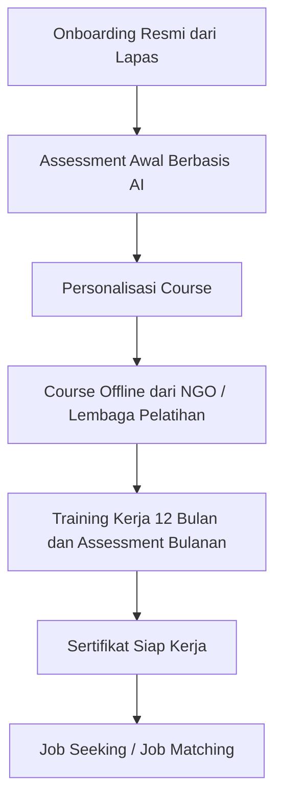

# ExCellera  
### A Structured Reintegration Platform for Second Chances at Work

 

  

 

ExCellera adalah platform digital terkontrol yang dirancang untuk membantu mantan narapidana kembali ke dunia kerja secara produktif, bermartabat, dan berkelanjutan. Platform ini hadir untuk menjawab tantangan utama pasca-bebas, seperti stigma sosial, keterbatasan akses pekerjaan, minimnya pendampingan pasca-pembebasan, serta tingginya risiko residivisme.

Berbeda dari platform pencari kerja konvensional, ExCellera menerapkan alur reintegrasi berurutan (sequence-based reintegration). Setiap pengguna harus melalui tahapan yang jelas dan terukur, mulai dari assessment awal, personalisasi course, training kerja 12 bulan, hingga job seeking berbasis sertifikasi kesiapan kerja.

Sebagai pendamping utama, ExCellera dilengkapi dengan CELLA AI, asisten berbasis Retrieval-Augmented Generation (RAG) yang memberikan dukungan belajar dan kesiapan kerja berdasarkan knowledge base internal yang terkurasi dan terverifikasi, sehingga aman, adil, dan bebas stigma.

<blockquote align='center'>
<h3>
“Mantan narapidana memiliki tingkat pengangguran yang jauh lebih tinggi dibandingkan populasi umum, yang secara signifikan meningkatkan risiko residivisme.”
</h3>
</blockquote>

Banyak mantan narapidana menghadapi hambatan serius untuk kembali bekerja karena:
<ul>
  <li>Minimnya kepercayaan dari pemberi kerja akibat stigma</li>
  <li>Ketidaksesuaian keterampilan dengan kebutuhan lapangan kerja</li>
  <li>Tidak adanya sistem pendampingan kerja yang terstruktur</li>
  <li>Proses rekrutmen yang tidak mempertimbangkan kesiapan kerja secara objektif</li>
</ul>

Tanpa intervensi yang tepat, kondisi ini berpotensi mendorong mantan narapidana kembali ke lingkaran kriminal.

  <h2>🎯 Solusi Utama <h2>

	  

 

  

 

 

  <h2>🔄 Flow Sistem ExCellera</h2>

 

  <h2>🎯 Kontribusi terhadap SDGs <h2>

 

SDG 8 – Pekerjaan Layak dan Pertumbuhan Ekonomi

Mendorong akses kerja yang adil dan inklusif bagi kelompok rentan melalui kesiapan kerja yang terverifikasi.

SDG 10 – Pengurangan Ketimpangan

Mengurangi ketimpangan sosial dengan membuka kesempatan kedua berbasis kemampuan, bukan stigma.

SDG 16 – Perdamaian, Keadilan, dan Institusi yang Tangguh

Menekan residivisme melalui sistem reintegrasi yang terstruktur dan berbasis data.
 
## 👨🏻‍💻 &nbsp;Technology Stack
 

&nbsp;&nbsp;&nbsp;

&nbsp;&nbsp;&nbsp;

&nbsp;&nbsp;&nbsp;

&nbsp;&nbsp;&nbsp;

 

<h4>PostgreSQL | Next.js | Gemini AI | JWT Authentication | Prisma ORM</h4>

 

  <h2>🧠 Arsitektur AI – CELLA (RAG) <h2>

 
CELLA AI menggunakan pendekatan Retrieval-Augmented Generation (RAG) dengan alur:
- Query dari user
- Retrieval ke knowledge base internal (materi course, panduan training, kebijakan)
- Pencarian vektor menggunakan pgvector
- Generasi jawaban oleh Gemini

Pendekatan ini memastikan keamanan, konsistensi, dan auditabilitas setiap respons.
ExCellera bukan sekadar aplikasi, melainkan sistem reintegrasi kerja berbasis struktur, kepercayaan, dan kesempatan kedua.

 

  <h2>Meet the Team</h2>
  
The people behind ExCellera

 |  |  |  |  |
| --- | --- | --- | --- | --- |
| 
<h3><b>Muhammad Aris Maulana</b></h3>
<i>Project Manager</i>

 | 
<h3><b>Nazla Azzahra Hermana</b></h3>
<i>UI/UX Designer</i>

 | 
<h3><b>Ladya Kalascha</b></h3>
<i>AI Engineer</i>

 | 
<h3><b>Gaza Al Ghozali Chansa</b></h3>
<i>Fullstack Developer</i>

 | 
<h3><b>Nicholas Gunawan</b></h3>
<i>Fullstack Developer</i>

 |
